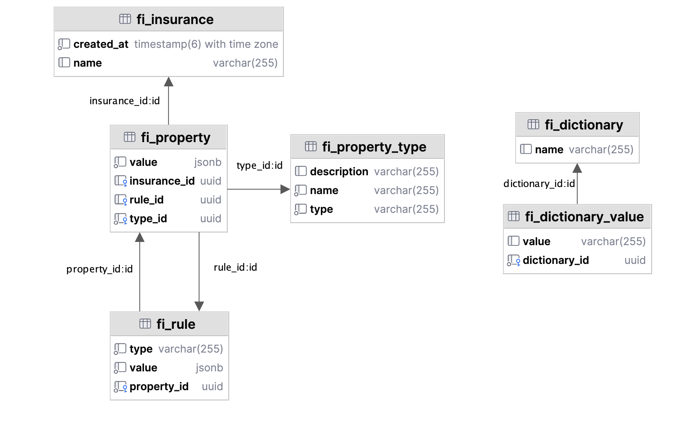

# BIV HACK x MISIS ZHABY
1. **Варвара Попадьина** - Frontend
2. **Агаверд Сейфаев** - Design
3. **Максим Манин** - Backend
4. **Максим Головизнин** - Backend

# Кейс "Конфигуратор страховых продуктов"
> Придумать способ задания и хранения параметров и связей для гибкой настройки страхового продукта, а также 
> концепт пользовательского интерфейса.

# Предложенное решение
## Frontend

## Backend
Backend-часть приложения представляет собой Spring приложение с подключенной к нему PostgreSQL базой данных
и REST API для управления данными.
### Схема данных

Схема данных состоит из нескольких таблиц. В сущности, мы реализовали EAV-паттерн, но видоизменили его под наши 
потребности.

* `insurance` - страховой продукт. состоит из набора свойств.
  * `created_at` - временная метка создания продукта. в данный момент не используется, но полезно иметь.
  * `name` - название страхового продукта.
* `property_type` - шаблон свойства страхового продукта.
  * `name` - название свойства.
  * `description` - описание свойства.
  * `type` - тип свойства. может принимать значения `float`, `boolean`, `string`, `date` либо `dictionary_id`,
    если тип является справочником.
* `property` - свойство страхового продукта.
  * `value` - значение свойства, хранится внутри json. для примитивных типов внутри json хранится только поле `value`,
    для справочных также хранится `dictionary_id`.
  * `insurance_id` - id продукта, к которому относится свойство.
  * `rule_id` - id правила, по которому это свойство может влиять на другие свойства.
  * `type_id` - id шаблона свойства.
* `rule` - правила, по которым одни свойства могут влиять на другие.
  * `type` - тип правила. может принимать значения `float`, `boolean`, `string`, `date` либо `dictionary_id`,
    если тип является справочником. от типа зависит структура поля `value`.
  * `value` - правило, которое ограничивает возможные значения свойств. для типов `float` и `date` это два поля `start`
    и `end`, которые ограничивают возможный диапазон значений. для типов `boolean` и `string` это одно конкретное значение.
    для справочного типа это массив `values`, определяющий все возможные значения свойства.
  * `property_id` - id свойства, к которому применяется правило.
* `dictionary` - справочный тип, по сути enum.
  * `name` - название типа.
* `dictionary_value` - значение справочного типа.
  * `value` - значение.
  * `dictionary_id` - id справочника, к которому относится значение.

### REST API
API в формате OpenAPI можно посмотреть здесь - [ссылка](biv-insurance-main/src/main/resources/api.yaml).

### Развёртывание
Для развёртывания backend составляющей приложения внутри вашей системы необходимы следующие шаги:
1. Установить Gradle, для этого необходимо:
  1. Установить JDK (Java Development Kit) версии 8 или выше. Гайд по установке (при необходимости) находится [здесь](https://www.oracle.com/java/technologies/downloads/)
  2. Установить Gradle с помощью инструкции по [этой](https://docs.gradle.org/current/userguide/installation.html) ссылке
  3. Проверить установку с помощью команды `gradle -v`
2. Сборка приложения с помощью ввода команды `./gradlew build` в директории `biv-insurance-main` данного проекта
3.  После сборки приложения для его запуска необходимо запустить созданный `.jar` файл
4.  Обращение к API будет доступно через данный URL: `localhost:8082`